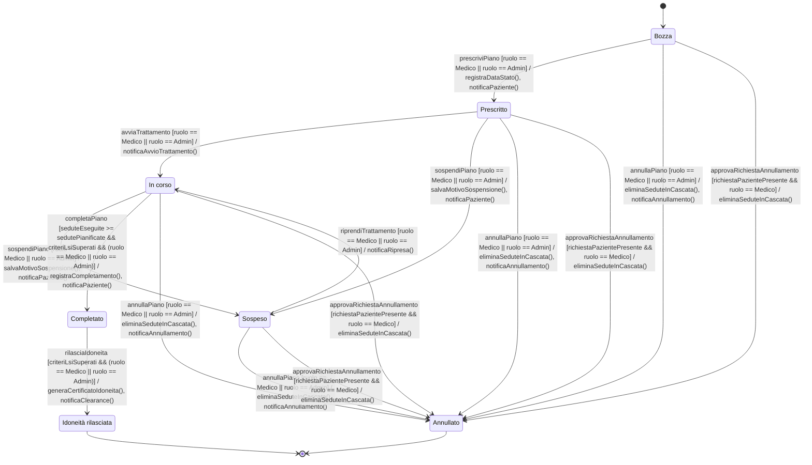

```mermaid
stateDiagram-v2
%% title MedicalHub - Ciclo di vita del Piano Riabilitativo

state "Bozza" as Bozza
state "Prescritto" as Prescritto
state "In corso" as InCorso
state "Sospeso" as Sospeso
state "Completato" as Completato
state "Idoneità rilasciata" as IdoneitaRilasciata
state "Annullato" as Annullato

[*] --> Bozza

Bozza --> Prescritto : prescriviPiano [ruolo == Medico || ruolo == Admin] / registraDataStato(), notificaPaziente()

Prescritto --> InCorso : avviaTrattamento [ruolo == Medico || ruolo == Admin] / notificaAvvioTrattamento()

Prescritto --> Sospeso : sospendiPiano [ruolo == Medico || ruolo == Admin] / salvaMotivoSospensione(), notificaPaziente()
InCorso --> Sospeso : sospendiPiano [ruolo == Medico || ruolo == Admin] / salvaMotivoSospensione(), notificaPaziente()
Sospeso --> InCorso : riprendiTrattamento [ruolo == Medico || ruolo == Admin] / notificaRipresa()

InCorso --> Completato : completaPiano [seduteEseguite >= sedutePianificate && criteriLsiSuperati && (ruolo == Medico || ruolo == Admin)] / registraCompletamento(), notificaPaziente()

Completato --> IdoneitaRilasciata : rilasciaIdoneita [criteriLsiSuperati && (ruolo == Medico || ruolo == Admin)] / generaCertificatoIdoneita(), notificaClearance()
IdoneitaRilasciata --> [*]

Bozza --> Annullato : annullaPiano [ruolo == Medico || ruolo == Admin] / eliminaSeduteInCascata(), notificaAnnullamento()
Prescritto --> Annullato : annullaPiano [ruolo == Medico || ruolo == Admin] / eliminaSeduteInCascata(), notificaAnnullamento()
InCorso --> Annullato : annullaPiano [ruolo == Medico || ruolo == Admin] / eliminaSeduteInCascata(), notificaAnnullamento()
Sospeso --> Annullato : annullaPiano [ruolo == Medico || ruolo == Admin] / eliminaSeduteInCascata(), notificaAnnullamento()

Bozza --> Annullato : approvaRichiestaAnnullamento [richiestaPazientePresente && ruolo == Medico] / eliminaSeduteInCascata()
Prescritto --> Annullato : approvaRichiestaAnnullamento [richiestaPazientePresente && ruolo == Medico] / eliminaSeduteInCascata()
InCorso --> Annullato : approvaRichiestaAnnullamento [richiestaPazientePresente && ruolo == Medico] / eliminaSeduteInCascata()
Sospeso --> Annullato : approvaRichiestaAnnullamento [richiestaPazientePresente && ruolo == Medico] / eliminaSeduteInCascata()

Annullato --> [*]
```
