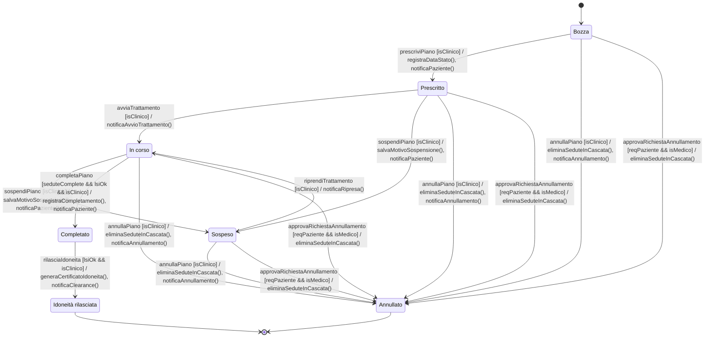

```mermaid
stateDiagram-v2
%% title MedicalHub - Ciclo di vita del Piano Riabilitativo

state "Bozza" as Bozza
state "Prescritto" as Prescritto
state "In corso" as InCorso
state "Sospeso" as Sospeso
state "Completato" as Completato
state "Idoneità rilasciata" as IdoneitaRilasciata
state "Annullato" as Annullato

[*] --> Bozza

Bozza --> Prescritto : prescriviPiano [isClinico] / registraDataStato(), notificaPaziente()
Prescritto --> InCorso : avviaTrattamento [isClinico] / notificaAvvioTrattamento()

Prescritto --> Sospeso : sospendiPiano [isClinico] / salvaMotivoSospensione(), notificaPaziente()
InCorso --> Sospeso : sospendiPiano [isClinico] / salvaMotivoSospensione(), notificaPaziente()
Sospeso --> InCorso : riprendiTrattamento [isClinico] / notificaRipresa()

InCorso --> Completato : completaPiano [seduteComplete && lsiOk && isClinico] / registraCompletamento(), notificaPaziente()
Completato --> IdoneitaRilasciata : rilasciaIdoneita [lsiOk && isClinico] / generaCertificatoIdoneita(), notificaClearance()
IdoneitaRilasciata --> [*]

Bozza --> Annullato : annullaPiano [isClinico] / eliminaSeduteInCascata(), notificaAnnullamento()
Prescritto --> Annullato : annullaPiano [isClinico] / eliminaSeduteInCascata(), notificaAnnullamento()
InCorso --> Annullato : annullaPiano [isClinico] / eliminaSeduteInCascata(), notificaAnnullamento()
Sospeso --> Annullato : annullaPiano [isClinico] / eliminaSeduteInCascata(), notificaAnnullamento()

Bozza --> Annullato : approvaRichiestaAnnullamento [reqPaziente && isMedico] / eliminaSeduteInCascata()
Prescritto --> Annullato : approvaRichiestaAnnullamento [reqPaziente && isMedico] / eliminaSeduteInCascata()
InCorso --> Annullato : approvaRichiestaAnnullamento [reqPaziente && isMedico] / eliminaSeduteInCascata()
Sospeso --> Annullato : approvaRichiestaAnnullamento [reqPaziente && isMedico] / eliminaSeduteInCascata()

Annullato --> [*]
```